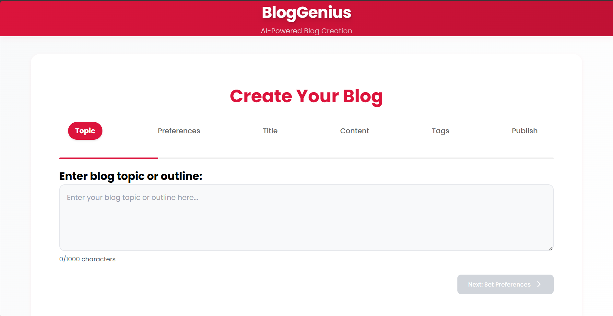

# Blog Automation Tool-Blog Genius

A powerful agentic web application that automates blog content creation and publication using advanced AI technology. Built with Flask and integrated with Cohere's AI models, this tool acts as an intelligent agent that autonomously streamlines your blogging workflow from content generation to Medium publication. The system employs multiple specialized AI agents working together to research, write, and refine your blog content with minimal human intervention.

## 🖥️ UI Display



The user interface features:
- Clean, modern design with an intuitive layout
- Step-by-step blog creation process
- Real-time content generation progress
- Rich text editor for content customization
- Preview functionality for generated content
- Easy-to-use publication controls

## 🌟 Features

- **AI-Powered Content Generation**: Utilizes CrewAI and Cohere for intelligent content creation
- **Title Generation**: Creates engaging blog titles
- **Automatic Tag Generation**: Suggests relevant tags for better content visibility
- **Content Editing**: Built-in editor for customizing generated content
- **Medium Integration**: Direct publication to Medium platform
- **PDF Export**: Download your blog posts as PDF files
- **Clean User Interface**: Simple and intuitive web interface

## 🚀 Getting Started

### Prerequisites

- Python 3.8+
- Required API Keys:
  - Cohere API key
  - Medium API token

### Installation

1. Clone the repository:
```bash
git clone <repository-url>
cd blog\ atumation
```

2. Install required packages:
```bash
pip install -r requirements.txt
```

3. Create a `.env` file in the root directory with your API keys:
```env
COHERE_API_KEY=your_cohere_api_key
MEDIUM_TOKEN=your_medium_token
```

4. Run the application:
```bash
python app.py
```

## 📦 Dependencies

- Flask
- Flask-CORS
- Cohere
- CrewAI
- langchain-cohere
- python-dotenv
- reportlab
- requests
- gunicorn (for production deployment)

## 📝 Usage

1. Access the web interface at `http://127.0.0.1:5000`
2. Enter your blog topic or requirements
3. Generate and customize content using the AI tools
4. Edit the generated content as needed
5. Publish directly to Medium or download as PDF

## 🔒 Security Note

Make sure to keep your API keys secure and never commit the `.env` file to version control.